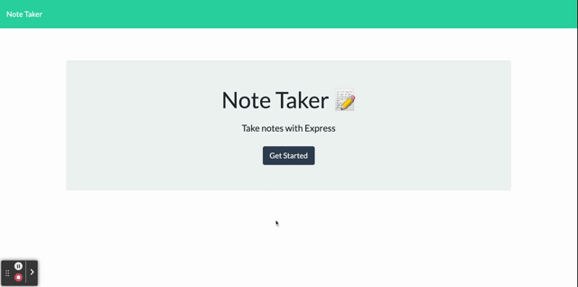

# Note Taker

## Description

This project is a Note Taker. It allows users to view, add and delete notes. The backend is built with [Express.js](https://expressjs.com). The webiste is deployed to Heroku.

View the deployed website: https://note-taker-4001.herokuapp.com

## Usage

* click the link to the notes page, the user can see all the existing notes listed in the left, plus empty fields to enter a new note in the right.
* enter both the title and text then the user can see a 'save' icon at the top of the page.
* click on the 'save' icon, then the note is saved and appears in the left column
* users can click the title from the existing notes on the left to view the whole note content.
* click on the 'delete' icon appears after each note, the user is able to delete the note from the list.

The animation below shows the appearance and functionality of the project:

## Technology Used
* [Express.js](https://expressjs.com)
* [Heroku](https://www.heroku.com)
## Question

Contact me via: ruxinqu@gmail.com if you have addition questions.